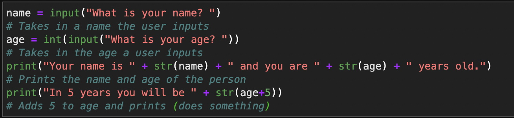

# Make-Something
A repo created for a group porject for CMPINF0010
# Group Members:
Wesley Hakanen
Paul Doherty
# What it Does
Asks for a name.
Asks for their age
Prints out their name and age in 5 years.
# Installation
## How to get it
Copy link of code in github. Then use open Juypterlab and open a terminal. Enter in "git clone" then a space and paste the link of our code in.
## How to run it
Hit shift enter to run the code.
# How to Use it
Run the code and follow the inputs asked for.

# How to Contribute
Use the code however you would like. There is no need to pull request because the code is open for use and changes.
# Code of Condut
We chose this Code of Conduct because we want the use of our code to be respectful and responsible. It is important to keep everyone in mind.
# License
We chose this license because our code is just for a student project and it is very simple.

